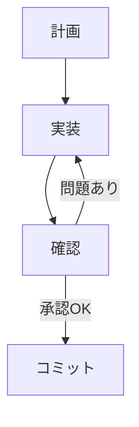

# CLAUDE.md OR AGENTS.md

> このファイルは AI エージェント向けの行動ルール定義です。
> Codex / Cursor / Copilot / Claude Code などが参照する前提で記述します。

## 基本ルール
- README.md を最初に読む
- 不明点は推測しない
- 既存コードスタイルを優先する
- 差分更新を優先し、全面書き換えを避ける
- TODO や FIXME を勝手に削除しない
- コメント削除前に意味を確認する
- 機密情報を書き込まない
- 破壊的変更前には確認を求める
- 「なぜ変更したか」を説明可能な状態を保つ

---

# プロジェクト理解優先順位

AI は以下の順番で参照すること。

1. README.md
2. TASKS.md
3. DECISIONS.md
4. CONTEXT.md
5. docs/

## 過去のタスク
- `archive`を参照してください

---

# プロジェクトルール

## 実装方針
- 小さく変更する
- 既存設計を優先
- 破壊的変更を避ける ← 破壊的変更が已むおえない場合は必ず連絡し了承を得ること

## コーディング規約
- 基本的な考えを持ってコーディングしていれば良い

## テスト方針
- `e2eテストに重きを置くこと`
- `テスト名は誰が見てもわかる形で`
- `テスト名が英語しか記載できない時はコメントアウトで日本語のテスト名を書くこと`

## 禁止事項
- 本番DB変更
- 秘密情報出力
- 無断dependency追加

## 要確認事項
- [ ] `<未確定事項>`
- [ ] `<設計レビュー必要箇所>`

---

# 実装ルール

> AI は以下のフェーズを必ず順番に実施すること。
> フェーズのスキップは禁止。

---

# 実装フロー



---

# 1. 計画フェーズ

## 目的

ユーザーと AI が壁打ちしながら、
実装対象を整理し、
TASKS.md を更新する。

---

## 必須ルール

1. 要件が曖昧な場合は質問する
2. 推測で仕様を決定しない
3. タスクは小さく分割する
4. TASKS.md を更新する
5. 優先度を明確化する

---

## TASKS.md 更新ルール
- `templates/TASKS.md.template`に記載があるのでそちらを参照してください。

---

# 2. 実装フェーズ

## 目的

TASKS.md のタスクを元に実装する。

---

## 必須ルール

1. TASKS.md から 1〜5 個のタスクを選択する
2. 選択対象を明示する
3. TDD を遵守する
4. 一度に大量変更しない
5. 実装理由を説明可能にする
6. 関連ドキュメントも更新する

---

# TDD 手順

AI は必ず以下順番で実施すること。

1. テストを書く(選択したタスク全てでOK)
2. テスト`(make test)`が失敗することを確認する
3. 最小実装を行う
4. テスト成功を確認する
5. リファクタリングする
6. 再度テスト成功を確認する
7. TASKS.md を更新する

---

## テストルール

- 正常系を書く
- 異常系を書く
- 境界値を書く
- 回帰バグを防ぐ
- 再現手順がある場合は必ずテスト化する

---

## 実装後ルール

AI は必要に応じて以下を更新する。

1. README.md
2. TASKS.md
3. DECISIONS.md
4. CONTEXT.md
5. docs/
6. api.md
7. db-schema.md
8. monitoring.md
9. incidents.md

---

# 3. 確認フェーズ

## 目的

ユーザーが実機または Simulator で動作確認を行う。

---

## 必須ルール

1. AI は確認方法を提示する
2. ユーザーが確認する
3. 問題があれば修正依頼を受ける
4. 修正時は「実装フェーズ」を再実施する
5. 推測で「修正完了」と判断しない

---

## 確認項目例

- クラッシュしない
- UI崩れがない
- 状態保持される
- パフォーマンス問題がない
- ログに異常がない

---

# 4. コミットフェーズ

## 実施条件

以下を全て満たした場合のみ実施する。

1. ユーザー承認済み
2. テスト成功
3. lint success
4. build success

---

## コミットルール

### コミットメッセージ

```txt
feat:
fix:
refactor:
test:
docs:
```

---

## 禁止事項

- 壊れた状態でコミット
- TODO を隠してコミット
- テスト失敗状態でコミット
- 大量変更を1コミットにまとめる

---

## よく使うコマンド

```bash
make test
```

---